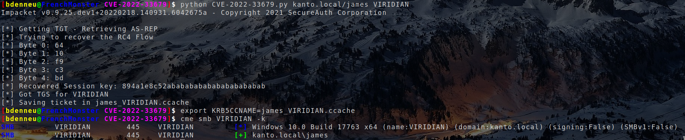

# CVE-2022-33679
One day based on https://googleprojectzero.blogspot.com/2022/10/rc4-is-still-considered-harmful.html

## Usage

```bash
usage: CVE-2022-33079.py [-h] [-ts] [-debug] [-dc-ip ip address] target serverName
```

## Example


